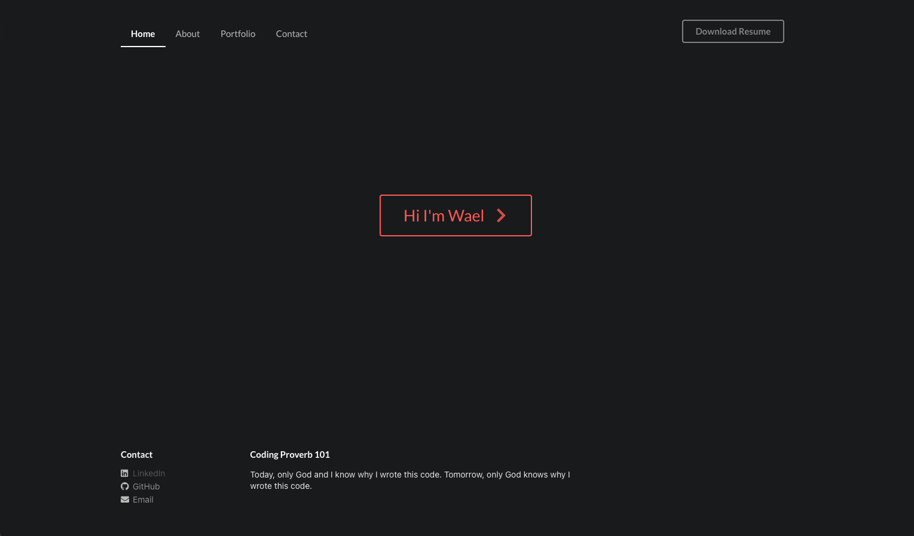
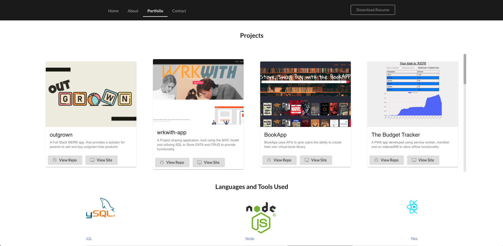
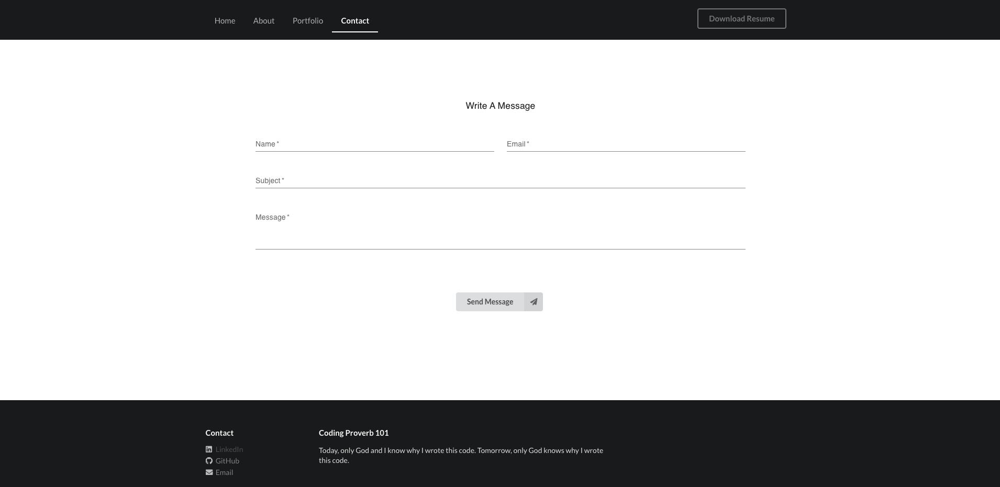

# Portfolio

## Description

A portfolio built uising React to place and showcase projects. The App has multiple pages consisting of multiple components that are rendered through relevant pages.

Note: Although this application does include a back end it is not fully connected at this stage and will be part of the next development updates.

The application features a portfolio page that consists of multiple cards containg information and releveant links to each project.

Material ui and Semantic ui have been used top build and design this portfolio.

## Screenshots

  ## Contents Table
  - [Installation](#Installation)
  - [Usage](#|Usage)
  - [Collaborators](#Collaborators)
  - [License](#License)
  - [Author](#Author)

## Installation

To install the app, clone the repo from GitHub, open in VS Code and open the terminal:

* step 1 `npm install`
* step 2 `npm run build`
* step 3 `npm run develop`

Ensure all dependencies and dev dependencies are installed if you encounter errors (npm install {package}).

## Usage

To run the App simply enter `npm run develop`

## Collaborators
none

## License
- 
- [title](https://opensource.org/licenses/MIT)
- [title](https://opensource.org/licenses/MIT)

## Author
- Wael Ahmed
- Find the repo for this on: https://github.com/wa20/Portfolio-Main
- Find gh-hub pages app deployment on: https://wa20.github.io/Portfolio-Main/
- Find heroku app deployment on: https://wael-portfolio.herokuapp.com

